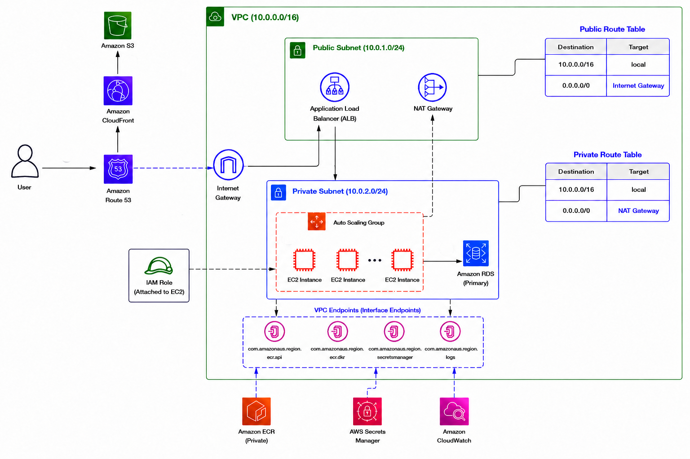

# Todo App — AWS Architecture (Terraform)


## Architecture Overview


---

## VPC Layout

| Resource | CIDR | AZ |
|---|---|---|
| VPC | 10.0.0.0/16 | — |
| Public Subnet 1 | 10.0.1.0/24 | AZ-1 |
| Public Subnet 2 | 10.0.3.0/24 | AZ-2 |
| Private Subnet 1 | 10.0.2.0/24 | AZ-1 |
| Private Subnet 2 | 10.0.4.0/24 | AZ-2 |

---

## All AWS Resources

| Service | Resource | Purpose |
|---|---|---|
| **VPC** | VPC, 2× public subnet, 2× private subnet | Network isolation |
| **VPC** | Internet Gateway | Public subnet egress |
| **VPC** | NAT Gateway + Elastic IP | Private subnet egress (fallback) |
| **VPC** | Route tables (public + private) | Routing |
| **VPC** | Security Groups (ALB, EC2, RDS, VPCE) | Layer-4 firewall |
| **VPC Endpoints** | `ecr.api` Interface | ECR auth/metadata, no internet |
| **VPC Endpoints** | `ecr.dkr` Interface | Docker pull, no internet |
| **VPC Endpoints** | `s3` Gateway | ECR layer pulls via S3, free |
| **VPC Endpoints** | `secretsmanager` Interface | DB credentials, no internet |
| **VPC Endpoints** | `logs` Interface | CloudWatch log shipping, no internet |
| **ECR** | Repository + lifecycle policy | Stores backend Docker image |
| **EC2 / ASG** | Launch Template | AL2023, Docker, user-data bootstrap |
| **EC2 / ASG** | Auto Scaling Group (2–4 instances) | Backend compute |
| **ALB** | Application Load Balancer | HTTPS termination, health checks |
| **ALB** | Target Group | Routes to EC2 port 3000 |
| **ALB** | Listeners (HTTP :80, HTTPS :443) | HTTP→HTTPS redirect + forwarding |
| **RDS** | MySQL 8.0 (db.t3.micro, single-AZ) | Persistent todo storage |
| **RDS** | DB Subnet Group | Spans both private subnets |
| **Secrets Manager** | RDS-managed secret | Auto-generated DB password |
| **S3** | Frontend bucket (private) | Static HTML/CSS/JS |
| **CloudFront** | Distribution + OAC | CDN, HTTPS, SPA routing |
| **ACM** | Certificate (us-east-2, CloudFront) | TLS for apex + www |
| **ACM** | Certificate (stack region, ALB) | TLS for api subdomain |
| **Route 53** | A records (apex, www, api) | DNS aliases to CloudFront + ALB |
| **IAM** | EC2 Role + Instance Profile | Least-privilege: ECR pull, Secrets, Logs, SSM |
| **IAM** | SSM Managed Policy | Shell access without SSH/bastion |
| **CloudWatch** | Log Group `/todo-app/backend` | Container logs, 14-day retention |

---

## Deploy Workflow

### Step 1 — First apply (creates all infra including ECR repo)

```bash
cd terraform
terraform init
terraform apply
```

At this point EC2 instances will launch but fail their health checks — the ECR repo exists but has no image yet. That's expected.

### Step 2 — Get your ECR repo URL

```bash
terraform output ecr_repository_url
# → 123456789012.dkr.ecr.us-east-2.amazonaws.com/todo-app-backend
```

### Step 3 — Build and push the backend image

```bash
# Authenticate
aws ecr get-login-password --region us-east-2 \
  | docker login --username AWS --password-stdin \
    123456789012.dkr.ecr.us-east-2.amazonaws.com

# Build and push
cd ../backend
docker build -t 123456789012.dkr.ecr.us-east-2.amazonaws.com/todo-app-backend:latest .
docker push 123456789012.dkr.ecr.us-east-2.amazonaws.com/todo-app-backend:latest
```

### Step 4 — Trigger instance refresh

```bash
aws autoscaling start-instance-refresh \
  --auto-scaling-group-name todo-app-asg \
  --region us-east-2
```

Instances will terminate and re-launch, pulling the image from ECR through the VPC endpoint. Health checks will pass once the container is running.

### Step 5 — Upload frontend

```bash
# Get bucket name
terraform output frontend_bucket_name

aws s3 sync ../frontend/ s3://$(terraform output -raw frontend_bucket_name)/

# Invalidate CloudFront cache
aws cloudfront create-invalidation \
  --distribution-id $(terraform output -raw cloudfront_distribution_id 2>/dev/null || echo "<get from console>") \
  --paths "/*"
```

### Step 6 — Verify

- Frontend: `https://muhammadmuddasir.cloud`
- API health: `https://api.muhammadmuddasir.cloud/health` → `{"status":"ok"}`

---

## Subsequent Image Deploys

```bash
docker build -t <ecr_repo_url>:latest ./backend
docker push <ecr_repo_url>:latest
aws autoscaling start-instance-refresh --auto-scaling-group-name todo-app-asg --region us-east-2
```

---

## Debugging

**Get a shell on an EC2 instance (no SSH needed):**
```bash
aws ssm start-session --target <instance-id> --region us-east-2
# On the instance:
docker ps
docker logs todo-app-backend-1
cat /opt/todo-app/docker-compose.yml
```

**Check CloudWatch logs:**
```bash
aws logs tail /todo-app/backend --follow --region us-east-2
```

---

## Teardown

```bash
# Empty the S3 bucket first (Terraform can't delete non-empty buckets)
aws s3 rm s3://$(terraform output -raw frontend_bucket_name) --recursive
# Empty the ECR repo
aws ecr batch-delete-image \
  --repository-name todo-app-backend \
  --image-ids imageTag=latest \
  --region us-east-2
terraform destroy
```
